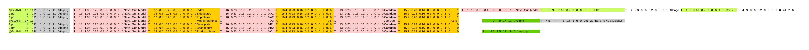
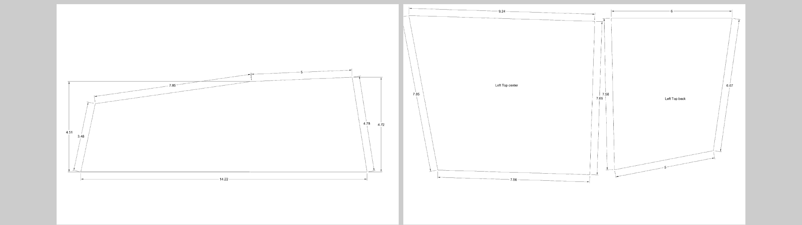
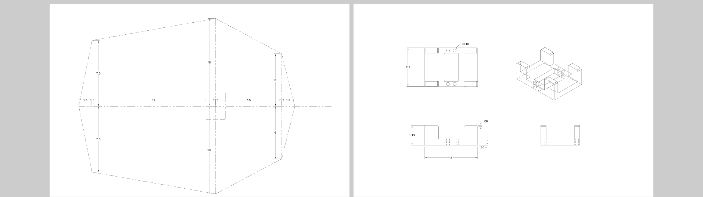
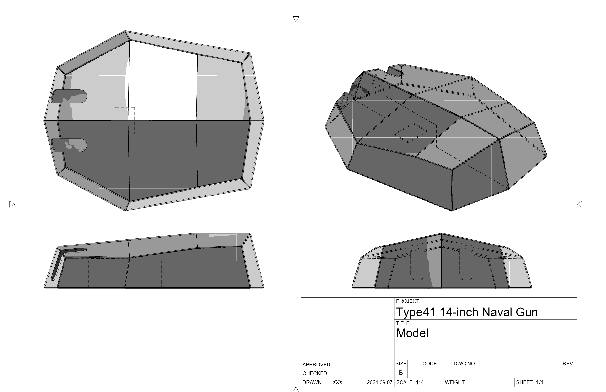
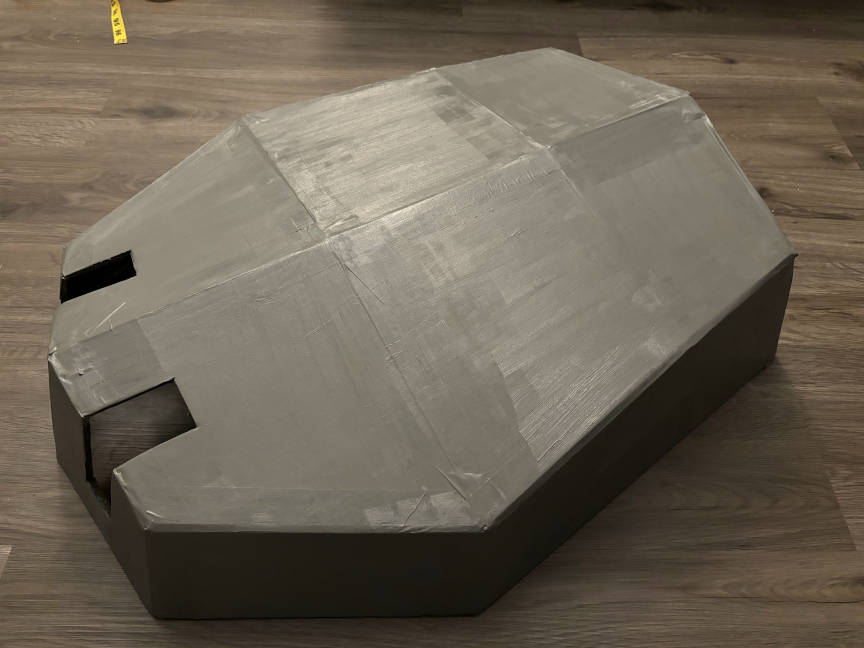
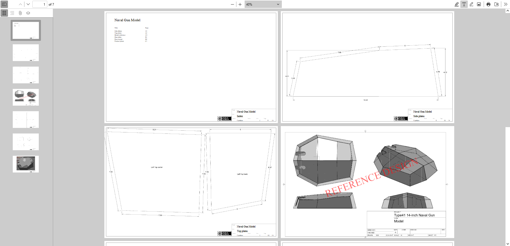

# DrawingTitleblock
Add custom titleblock to engineering drawing

## How to use
Select or drop index file (CSV), drawings (PDF) and pictures (JPEG and PNG) in the bottom-left input area.

## Index file syntax
Each row of the index file represents a page.

### Type
The first element of each row is the page type. It can be a specific page from a drawing file, or a blank page with specific size.
```
@BLANK,width,height
@BLANK,17,11
```
If the first field is “@BLANK”, this program will create a blank page and use the next two parameters as the dimension (in inch) of the blank page. The example will create a page 17 inches wide and 11 inches high (Tabloid, landscape).
```
file,page,rotation
a.pdf,5,90
```
Otherwise, it copies a specific page from a specific PDF file. The first two parameters of the row are used to define the source PDF filename and page number (page starts at 1). The third parameter indicates rotation of the PDF page in degree. The above example copies the 5th page from the PDF file “a.pdf”, and rotates it by 90 degrees.

Note: The rotate only sets the view orientation of that page, it doesn’t modify that page at all.

Following can be one or more elements. Elements can be:

Note: Origin is at lower-left corner (before rotation).

### Text
Starting with the text symbol ‘T’ means Text. Following are parameters for x-y position, text height, line height (all in inches), RGBA color (0.0 to 1.0), rotation (in degrees) and the text to write. “\n” in text will make a new line.
```
T,x,y,h,lh,r,g,b,a,rotate,'text\nand new line'
T,1,3,0.1,0.15,1,0,0,0.5,20,Some text
```
The above example will place a string of “Some text” at position (x = 1, y = 3). The text will be 0.1 inch height , and line height will be 0.15 inch. The color will be half transparent red.

### Picture
Starting with the text symbol ‘P’ means Picture. Following are parameters for x-y position, picture width and height (all in inches), rotation (in degrees) and the filename of the picture. Both PNG and JPEG are supported. Furthermore, PNG can be used to insert pictures with a transparent background. 
```
P,x,y,w,h,rotate,filename
P,9,5,4,2,45,icon.png
```
The above example will insert the picture “icon.png” at (x = 9, y = 5). The size of this picture will be 4 inches wide and 2 inches high, rotated by 45 degrees.

### Index
Starting with the text symbol ‘I’ means Index. Following parameters follow the same syntax as the Text except the tailing few are used to reference to fields to be indexed. ```ref_col``` indicates which column (left-most column is 1, empty columns are counted) of the index file to be copied into the index. ```ref_rowStart``` indicates the first row (first row in index file is 1) to be included into the index and ```ref_rowLen``` indicates how many rows to be indexed.
```
I,x,y,h,lh,r,g,b,a,rotate,ref_col,ref_rowStart,ref_rowLen
I,1,10,0.1,0.15,0,0,0,1,0,5,2,20
```
The above example will place the index at (x = 1, y = 10) using 0.1-in high text and 0.15-in line height in solid black. The index will use the 5th column of the index file, starts from 2nd row and for 20 rows.

### Empty space in index file
Empty fields are ignored to help align elements in the CSV editor (so you can drag numbers in spreadsheet softwares). Following two are equivalent:
```
@BLANK,17,11,T,1,3,0.1,0.15,1,0,0,0.5,20,Some text,,,T,1,3,0.1,0.15,1,0,0,0.5,20,More text
@BLANK,17,11,,,T,1,3,0.1,0.15,1,0,0,0.5,,,,20,Some text,T,1,3,0.1,0.15,1,0,0,0.5,20,More text
```

## Example
Following example contains a drawing package of an index page, two PDF drawings, a scan reference document in PNG and a product photo in JPEG.

### Source files

[Index file - Raw](example/example.csv)


[Drawing 1 - Raw](example/1.pdf)


[Drawing 2 - Raw](example/2.pdf)






### The index
We would like to make the first page to be the index page of the drawing package with titleblock. There is what we do:
1. Create a blank 17x11-inch page.
   ```
   @BLANK,17,11
   ```
2. Insert titleblock as a PNG image the same size as the page with transparent background at origin (0,0). Therefore, the titleblock image will cover the entire page.
   ```
   P,0,0,17,11,0,tb.png
   ```
3. Place project name, page title, page number, total page count, author name and reversion number on the page at the specific locations.
   ```
   T,13,1.05,0.25,0.3,0,0,0,1,0,Naval Gun Model	// Project name
   T,13,0.6,0.25,0.3,0,0,0,1,0,Index		// Page title
   T,16,0.23,0.16,0.2,0,0,0,1,0,0		// Page number
   T,16.4,0.23,0.16,0.2,0,0,0,1,0,/ 6		// Page count
   T,13,0.23,0.16,0.2,0,0,0,1,0,Captdam		// Author
   T,15.2,0.23,0.16,0.2,0,0,0,1,0,1		// Reversion
   ```
4. Place the project name at top of the page using a large font size. Place index title.
   ```
   T,1,10,0.35,0.4,0,0,0,1,0,Naval Gun Model
   T,1,9.3,0.16,0.2,0,0,0,1,0,Title
   T,4,9.3,0.16,0.2,0,0,0,1,0,Page
   ```
5. Lookup fields in this index file and place them onto the page. In this example, we have two fields to be indexed. The first field is the 33th column of the index file, which is the page title; the second field is the 44th column of the index file, which is the page number. We will start the index from the 2nd row (we don’t need to include the index page in our index), and we will index 6 rows.
   ```
   I,1,9,0.16,0.2,0,0,0,1,0,33,2,6
   I,4,9,0.16,0.2,0,0,0,1,0,44,2,6
   ```
___

For the second and third page, we would like to include two pages from our first PDF file “1.pdf”. Furthermore, for the 5th and 6th page, we would like to include two pages from another PDF file “2.pdf”. So, we do:
1. Include a PDF file and specify the page number and rotation. In the example, we select the 1st page from “1.pdf”, no rotation.
   ```
   1.pdf,1,0
   ```
2. Insert title block and place all the necessary text fields, same as step 2 to 4 of the index page.
   ```
   P,0,0,17,11,0,tb.png				// Titleblack
   T,13,1.05,0.25,0.3,0,0,0,1,0,Naval Gun Model	// Project name
   T,13,0.6,0.25,0.3,0,0,0,1,0,Side plates		// Page title
   T,16,0.23,0.16,0.2,0,0,0,1,0,A1			// Page number
   T,16.4,0.23,0.16,0.2,0,0,0,1,0,/ 6		// Page count
   T,13,0.23,0.16,0.2,0,0,0,1,0,Captdam		// Author
   T,15.2,0.23,0.16,0.2,0,0,0,1,0,0		// Reversion
   ```
___

For the 4th page, we would like to include a scan of reference drawing “r1.png”. Since this drawing has its own titleblock, we shouldn’t draw our own titleblock on top of it. So, we do:
1. Create a blank 17x11-inch page.
   ```
   @BLANK,17,11
   ```
2. Although we don’t draw the titleblock and insert all the necessary text fields, we need these text fields to generate the index. We use the “X” notation to indicate dummy fields. In this way, these text fields won’t be inserted into the page but will still be read by the indexer.
   ```
   X,Naval Gun Model	// Project name
   X,Model reference	// Page title
   X,A3			// Page number
   X,/ 6		// Page count
   X,Joe Doe		// Author
   X,As-is		// Reversion
   ```
3. Insert the picture “r1.png” the same size as the page at origin (0,0), so, the scanned reference document will cover the entire page.
   ```
   P,0,0,17,11,0,r1.png
   ```
4. Place a semi-transparent red text with some degrees of rotation on the page to indicate “Reference Design”.
   ```
   T,4.5,4,1,1.5,1,0,0,0.5,20,REFERENCE DESIGN
   ```
___
For the last page, we would like to have a photo of the product. We also want titleblock for this page. We can do:
1. Create a blank 17x11-inch page.
   ```
   @BLANK,17,11
   ```
2. Insert title block and place all the necessary text fields, same as step 2 to 4 of the index page.
   ```
   P,0,0,17,11,0,tb.png				// Titleblack
   T,13,1.05,0.25,0.3,0,0,0,1,0,Naval Gun Model	// Project name
   T,13,0.6,0.25,0.3,0,0,0,1,0,Product photo	// Page title
   T,16,0.23,0.16,0.2,0,0,0,1,0,C1		// Page number
   T,16.4,0.23,0.16,0.2,0,0,0,1,0,/ 6		// Page count
   T,13,0.23,0.16,0.2,0,0,0,1,0,Captdam		// Author
   T,15.2,0.23,0.16,0.2,0,0,0,1,0,0		// Reversion
   ```
3. Insert the photo “photo.jpg” at an appropriate place and size.
   ```
   P,2.5,1.5,12,9,0,photo.jpg
   ```

### Final result
Following is the result PDF:

[Result file - Raw](example/result.pdf)
